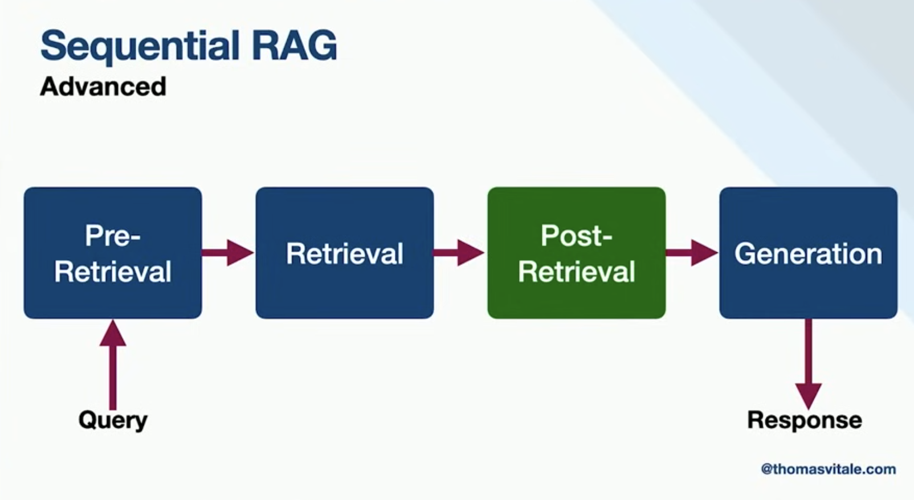
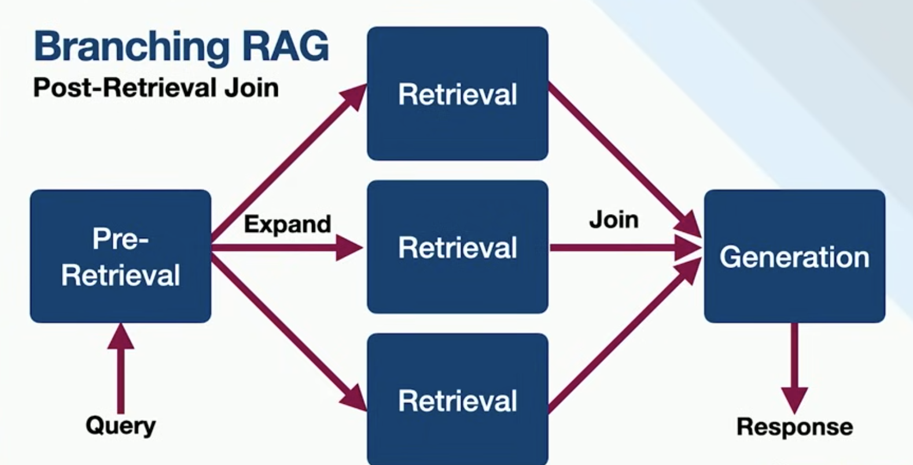

# modular-rag

Inspired from [this repo](https://github.com/ThomasVitale/modular-rag/blob/main/README.md) & [this video](https://www.youtube.com/watch?v=yQQEnXRMvUA&list=WL&index=29&t=952s)

### Run a local llm
```shell
docker volume create ollama-mistral
docker run --rm -p 11434:11434 --name ollama -v ollama-mistral:/root/.ollama/models ollama/ollama

docker exec -it ollama ollama pull mistral \
  && ollama pull nomic-embed-text \
  && ollama list
```

### Run

```shell
./mvnw clean install
./mvnw spring-boot:test-run
```

### Test

```shell
http :8080/chat question="current time in Copenhagen"

# Streaming response
echo '{"question":"tell me a joke"}' | http --stream POST :8080/chat/stream Content-Type:application/json Accept:application/x-ndjson
http --stream POST :8080/chat/stream Content-Type:application/json Accept:application/x-ndjson question='Tell me a joke'
```

### Different types of RAG flows


---


---
[image](./conditional-rag.png)